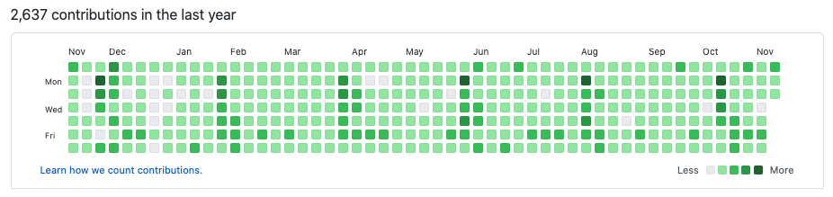

# Github Green Wave 🌿

Github Green Wave helps you to keep your Github contribution timeline green by automatically creating commits. With Github Green Wave you can make it look like you are the hardest working developer in your company, even though you're just hanging out in front of Netflix all day.



This project is built using [isomorphic-git](https://github.com/isomorphic-git/isomorphic-git) and [memfs](https://github.com/streamich/memfs), so it doesn't depend on Git or a local file system and will run as a Google Cloud Function.

Before you consider faking commits to polish your contribution calender, you might want to [read this note](#note).

## Usage

- Clone repository `git clone https://github.com/stekhn/github-green-wave.git`
- Create the [target repository](#target-repository)
- Create a [configuration file](#configuration-file)

Run it on your local machine ...

- Install required dependencies `npm install`
- Start development server `npm watch`

... or run it in the cloud

- [Deploy to Google Cloud](#google-cloud-deployment)

This script is written in JavaScript and requires [Node.js](https://nodejs.org/en/) to run.

## Target repository

You'll need to [create a new Github repository](https://docs.github.com/en/free-pro-team@latest/github/getting-started-with-github/create-a-repo) that will serve as a target for your fake commits. This Github repo will host one file, that is going to be periodically updated in order to make those sweet commits. Of course, you can set this repository to be private, if you want to hide your shenanigans from your honest co-workers.

## Configuration file

In order to access the target repo, you'll need to [create a personal access token](https://help.github.com/en/github/authenticating-to-github/creating-a-personal-access-token-for-the-command-line).

Once you've obtained your access token, it's time to create a new configuration file. The file should be called `config.json` and should be located in the root folder. To make this easier, you can simply copy and edit the configuration template:

```console
$ cp config.template.json config.json
```

This is what the configuration file should look like:

```json
{
  "dir": "/",
  "filename": "dummy.txt",
  "auth": {
    "username": "my-username",
    "token": "XXXXXXXXXXXXXXXXXXXXXXXXXXXXXXXXXXXXXXXX",
    "password": "",
    "url": "https://github.com/my-username/my-repo.git"
  },
  "commit": {
    "author": {
      "name": "First Last",
      "email": "first.last@example.org"
    },
    "message": "Update file"
  },
  "probability": 1
}
```

Here's a brief explanation of the different configuration options:

- `dir`: The location where your target file is going to be stored. Per default this location is the root folder `/` of your project. There is no good reason to change this.
- `filename`: The name of the file you want to change automatically.
- `auth`: Your personal access token and URL for your Github target repository.
- `commit`: The commit author and message that is sent along with every commit. This does not have to be your real name oder e-mail adress and can be different from your Github user account.
- `probability`: Randomize the number of commits every day. The chance that a commit will happen is a decimal from `0` (0 %) to `1` (100 %). To have a 50 % chance of a commit succeeding enter `0.5`.

How many commits should be made every they is determined differently. This function is build to make one commit every time it runs. If you'd like multiple commits per day, you'll have to run the function multiple times per day. This can be achieved using a simple cron job or a full fledged CI environment like Jenkins. However, Google Cloud Functions using Google Cloud Scheduler provide a reliable an cheap option to run Github Green Wave in the cloud.

## Google Cloud deployment

These instructions assume that you already have a Google Cloud account and set up a billing account. To use the commands below, you'll need to install the [Google Cloud SDK](https://cloud.google.com/sdk/install) (CLI) and [link](https://cloud.google.com/sdk/docs/initializing) it to your account.

### Create project

Create a new Google Cloud project:

```console
$ gcloud projects create github-green-wave
```

Set the new project as your current project:

```console
$ gcloud config set project github-green-wave
```

### Deploy function

Enable Google Cloud Functions for the current project:

```console
$ gcloud services enable cloudfunctions.googleapis.com
```

Select the [region](https://cloud.google.com/compute/docs/regions-zones) (data center) where your function should be deployed:

```console
$ gcloud config set functions/region europe-west1
```

Create a new pub/sub topic, which triggers the function:

```console
gcloud pubsub topics create start-green-wave
```

Deploy the function as Node.js application and link it to your pub/sub trigger.

```console
$ gcloud functions deploy githubGreenWave --runtime nodejs10 --trigger-topic start-green-wave
```

Since the function is going to be triggered with a Google Cloud Scheduler, you should disallow public access to your function by answering the command prompt with `N` (no):

```console
Allow unauthenticated invocations of new function [githubGreenWave]? (y/N)?
```

### Schedule commits

Enable the Google Cloud Scheduler:

```console
$ gcloud services enable cloudscheduler.googleapis.com
```

Create a Google Cloud Scheduler task that automatically triggers the function every 2 hours between 12 am and 6 pm. If you would like a different schedule, use [cron tab](https://cron.help/) to change the `--schedule` parameter value. You should also adjust the `--time-zone` parameter to your [local time zone](https://en.wikipedia.org/wiki/List_of_tz_database_time_zones):

```console
gcloud scheduler jobs create pubsub github-green-wave --topic=start-green-wave --schedule="0 12-18/2 * * 1-5" --time-zone="Europe/Brussels" --message-body="undefined"
```


```console
gcloud functions call publish --data '{ "topic": "start-green-wave", "message": "undefined" }'
```

## Local testing

If happen to fork this repository, it might be smart to test the changes to your code on your local machine first. The best way to test the script locally is to use the [Google Functions Framework](https://cloud.google.com/functions/docs/functions-framework). The Functions Framework can be started with the command `npm run watch`. This has the advantage that the script is reloaded every time you make changes to the code.

You can also install the Functions Framework globally ...

```console
$ npm i -g @google-cloud/functions-framework
```

... and start the function manually:

```console
$ functions-framework --target=githubGreenWave
```

To trigger the function, send a simple HTTP request to the local server hosting your function:

```console
$ curl -X GET 'localhost:8080'
```

## Note

This project is a fun coding exercise. However, evaluating developers by the number of their commits is complete nonsense. Especially since nowadays most commits are made in private company repos or on different platforms. The number of commits is a metric that says nothing about a programmer's diligence or code quality. Constantly counting commits only gets in the way of bigger and more important goals, like a achieving a healthy work life balance or working on projects that really matter. There is an open issue in Github's backlog, highlighting the [potential harmfulness of the contribution graph](https://github.com/isaacs/github/issues/627).

**TLDR;** Commits are like Twitter followers, you have to work hard to get them, but the person with the most followers is not always the hardest working or [most likable person](https://twitter.com/realDonaldTrump).

## Acknowledgements

Without these incredible libraries, this project wouldn't have been possible:

- [isomorphic-git](https://github.com/isomorphic-git/isomorphic-git): Implementation of Git in pure JavaScript
- [memfs](https://github.com/streamich/memfs): Virtual file system for Node.js
